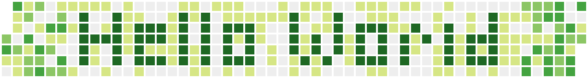

  <h1>Ruslan Gonzalez 👨‍💻</h1> 

  
  
  

  Yeah! I'm the guy! a JavaScript Developer Enthusiast, Angular, ReactJs, NestJS and Open Source lover ❤. 

<ul>
  <li><strong>Twitch:</strong> <a href="https://twitch.com/rusgunx">@rusgunx</a></li>
  <li><strong>Twitter:</strong> <a href="https://twitter.com/ruslangonzalez">@ruslangonzalez</a></li>
</ul>

